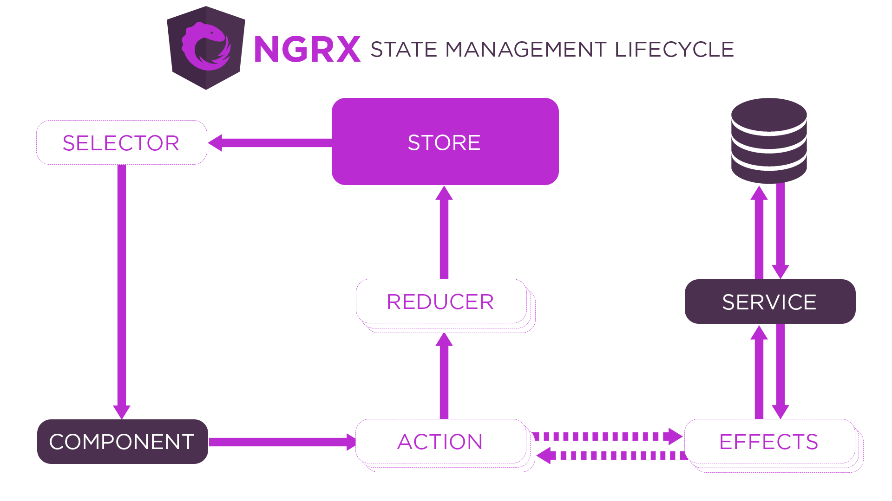

## **Gyakorlófeladat**

Készíts egy egyszerű, Angular alapú alkalmazást. Az alkalmazás célja, hogy az adatok kezelése az NGRX modulon keresztül legyen megvalósítva.

Fontos: az **angular-feladat-01** feladatot kell továbbfejlesztened. Csak azokra a részekre térek ki, amelyek eltérnek az eredeti alkalmazástól. Új alkalmazást hozz létre ennek a feladatnak is, a meglévő fájlokat pedig másold át.

Az alkalmazás filmeket kezel, ilyen adatokat generálj a mockaroo segítségével.

1. Oldalak:
    - editor: listázzon ki egy szabadon választott tömböt, amelyet a json-server-auth segítségével kér le egy service-en keresztül (movies).
    - movieEditor: egy bizonyos filmet jelenítsen meg egy űrlapon. Nem kell a szerkesztést is megoldani, a helyes megjelenítés a lényeg. Az editor oldalról való kattintással lehessen megnyitni ezt az oldalt és az url-ből vett paraméter hatására jelenítse meg a kiválasztott filmet, úgy, hogy a store-ből lekéri az id alapján.

2. State management: 
    - A store neve egyezzen meg a választott témával, tehát a store-on belül ott legyen elhelyezve (pl.: import { UserReducer } from './store/movie/MovieReducers'; ).
    - A reducers-ben is csak három szelektorra lesz szükség: selectItems, selectOneItem és selectError.
    - Az effect-ben is csak a loadItems$ és a getOneItem$ megvalósítása szükséges.
    - Az editor és movieEditor oldalakon a megfelelő selector-ok használatával jelenítsd meg az adatokat.

**Segítség**

  - Az adott store-hoz mindig külön fájlban hozd létre az action-öket, reducer-eket és effect-eket.
  - Használd a dokumentációt: https://ngrx.io/guide/store
  - Így függenek össze a store egyes elemei:
    
  

  - Ne feledd, az adatok csak egy irányba mozoghatnak. Ezért nem egyszerűen csak lekérjük őket, hanem először dispatch-elünk egy action-t, majd a hatására beöltődő adatokat szelektáljuk, például így:
  - [a hivatkozott sor és az alatta lévő] (https://github.com/cherryApp/angular-advanced-course/blob/03f4efcb7a1078ae1fa7222d03fd36eb2b493bd6/chapter03-ngrx/src/app/page/users/users.component.ts#L37)
